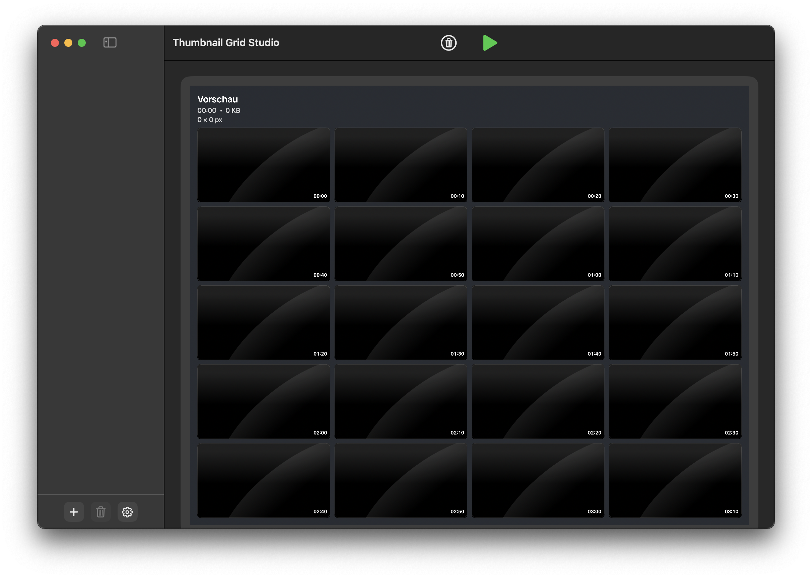

# Thumbnail Grid Studio

Thumbnail Grid Studio is a desktop app for creating contact-sheet style preview images from video files (`JPG` or `PNG`).

The repository contains two native implementations:

| Platform | Stack | Status | Build Output | Details |
|---|---|---|---|---|
| macOS | SwiftUI + Swift CLI | Implemented | `apps/macos/dist/Thumbnail Grid Studio.app` | [macOS README](./apps/macos/README.md) |
| Windows | WinUI 3 + .NET 8 | Implemented | `apps/windows/dist/Thumbnail Grid Studio/ThumbnailGridStudio.exe` | [Windows README](./apps/windows/README.md) |

## Application Overview

- Import multiple videos via drag and drop or file picker
- Generate thumbnail grids/contact sheets with configurable layout
- Customize spacing, colors, metadata visibility, and font sizes
- Export as `JPG` or `PNG`
- Bundled `ffmpeg`/`ffprobe` for broad format support (`mp4`, `mov`, `avi`, `mkv`, `webm`, ...)

## Screenshots

| macOS | Windows |
|---|---|
|  |  |

## Repository Layout

- `apps/macos`: macOS app source, packaging scripts, CLI
- `apps/windows`: Windows app source, build/publish scripts

## Platform Documentation

- [macOS README](./apps/macos/README.md)
- [Windows README](./apps/windows/README.md)
- [macOS CLI Documentation](./apps/macos/docs/CLI.md)
