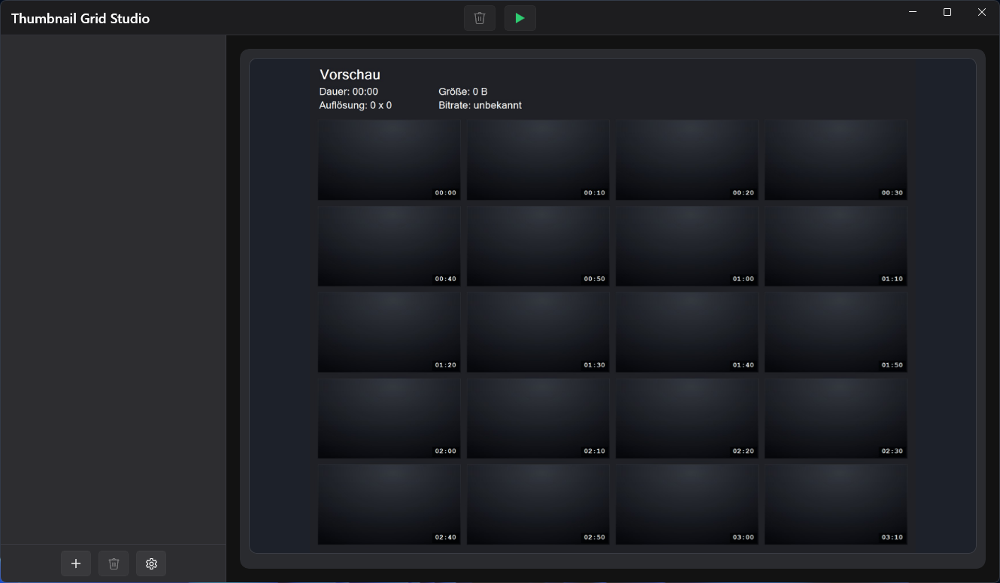

# Thumbnail Grid Studio

This is a vibe-coding project. I do not plan to review pull requests or handle issues for this repository.

Thumbnail Grid Studio is a native Windows app built with WinUI 3 and .NET 10 that imports multiple videos and exports a video preview image for each one as `JPG` or `PNG`.



## Features

The most important capabilities in the current version are:

- Multi-file import via drag and drop or file picker
- Contact sheet style video preview export with timestamps on every thumbnail
- Configurable grid, thumbnail size, spacing, colors, metadata visibility, and font sizes
- Built-in `ffmpeg` and `ffprobe` for broader format support such as `mkv`, `avi`, and `webm`
- Windows 11 style custom title bar and controls
- Persistent settings across app restarts
- German and English UI localization (based on Windows display language)
- One-click render and export for all loaded videos
- Light gray empty preview state with centered workspace title
- Additional CLI app that can reuse GUI settings and override them via command line

## Requirements

- Windows 10 (19041) or newer
- .NET SDK 10.0+
- Visual Studio Build Tools / Visual Studio with MSBuild support

## Development

```powershell
powershell -ExecutionPolicy Bypass -File .\apps\windows\build-winui.ps1 -Configuration Release -Platform x64
```

For publish output:

```powershell
powershell -ExecutionPolicy Bypass -File .\apps\windows\publish-winui-selfcontained.ps1 -Configuration Release -Runtime win-x64 -Platform x64
```

The publish script also places `ThumbnailGridStudio-cli.exe` in the same app directory
(`apps/windows/dist/Thumbnail Grid Studio`) and includes it in the generated ZIP.
The CLI is framework-dependent; the publish script additionally downloads
`dotnet-runtime-10.0.3-win-x64.exe` into the same directory so the required runtime can be installed offline.
The publish step removes app-local `hostfxr.dll` to avoid host resolution conflicts between
the self-contained GUI files and the framework-dependent CLI executable.

Build CLI:

```powershell
dotnet build .\apps\windows\ThumbnailGridStudio.Cli\ThumbnailGridStudio.Cli.csproj -c Release
```

Run CLI:

```powershell
dotnet run --project .\apps\windows\ThumbnailGridStudio.Cli\ThumbnailGridStudio.Cli.csproj -- `
  --input "D:\Videos" `
  --output "D:\Exports" `
  --columns 5 `
  --rows 4 `
  --format png `
  --show-timestamp true
```

The CLI first loads GUI settings from `%LOCALAPPDATA%\ThumbnailGridStudio\settings.json`.
All passed CLI parameters override the loaded values.

## Project Structure

- `apps/windows/ThumbnailGridStudio.WinUI`: WinUI 3 app sources, view models, renderer, and services
- `apps/windows/ThumbnailGridStudio.Cli`: command line renderer
- `apps/windows/ThumbnailGridStudio.WinUI/Assets`: app icon assets
- `apps/windows/ThumbnailGridStudio.WinUI/Tools/win-x64`: bundled `ffmpeg` and `ffprobe`
- `apps/windows/build-winui.ps1`: local build script
- `apps/windows/publish-winui-selfcontained.ps1`: publish script and artifact copy step
- `apps/windows/screen.png`: Windows app screenshot

## Build Output

The published app is generated to:

- `apps/windows/dist/Thumbnail Grid Studio`

Main executable:

- `apps/windows/dist/Thumbnail Grid Studio/ThumbnailGridStudio.exe`

## Notes

- `ffmpeg` and `ffprobe` are bundled, so no separate installation is required.
- Publish includes required WinUI XAML artifacts (`.xbf`, `.pri`) to avoid startup parse errors.
- Exported images use the same base filename as the video, with the selected image extension.
